# WordPress Website Deployment, Backup and Restoration

# Project Overview

# This project demonstrates a complete Disaster Recovery lifecycle for a WordPress website.

# The objective is to:

- Deploy a WordPress website
- Configure users and themes
- Create a complete backup
- Simulate disaster by removing all components
- Restore the website from backup
- Validate recovery 

# Technologies Used

| Component | Technology |
|------------|------------|
| Operating System | Ubuntu 22.04 |
| Web Server | Apache2 |
| Language | PHP |
| Database | MariaDB |
| CMS | WordPress |
| Backup Tools | tar, mysqldump |
| User Management | WP-CLI |
| Version Control | Git & GitHub | 


# Architecture

```text
Browser
   |
Apache
   |
WordPress
   |
MariaDB
```  


# Project Workflow

```text
Deploy
   ↓
Configure
   ↓
Backup
   ↓
Remove
   ↓
Restore
   ↓
Validate
```  

# Project Structure

```text
wp-backup-restoration-project
├── docs
│   ├── architecture.md
│   ├── backup.md
│   ├── installation.md
│   ├── removal.md
│   ├── restoration.md
│   ├── troubleshooting.md
│   ├── verification.md
│   └── workflow.md
├── .gitignore
├── README.md
├── screenshot
│   ├── apache-gzip-content.png
│   ├── apache-version-status.png
│   ├── database-apache-removed.png
│   ├── gzipfile-content.png
│   ├── mysql-version-status.png
│   ├── php-version-module.png
│   ├── pre-site-view.png
│   ├── wpsite-view-post-restoration.png
│   ├── user-verify-after-restoration.png
│   ├── wordpress-removal-validation.png
│   ├── wp-backup-created.png
│   ├── wp-database-user.png
│   └── wp-table-verify-after-restoration.png
└── wordpress-backup
    ├── apache-config.tar.gz
    ├── .gitkeep
    ├── sample-backup-structure.txt
    ├── wordpressdb.sql   
    └── wordpress-files.tar.gz
```


# Features Implemented

# WordPress Deployment

- Apache Installation
- PHP Installation
- MariaDB Installation
- WordPress Setup

# Website Configuration

- Theme Installation
- User Creation
- Password Reset through CLI
- Website Customization

# Backup

- Website Files Backup
- Database Backup
- Apache Configuration Backup

# Disaster Recovery

- Website Removal
- Dependency Removal
- Database Deletion

# Restoration

- File Restoration
- Database Restoration
- Configuration Restoration

# Verification

-Successfully verified:

- Website accessibility
- Theme restoration
- User restoration
- Database restoration
- Website content integrity  

# Screenshots

# WordPress Homepage

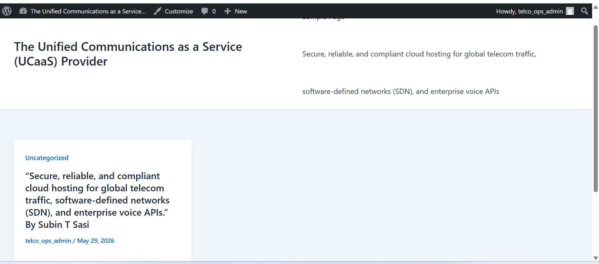

# Apache Installation Verification

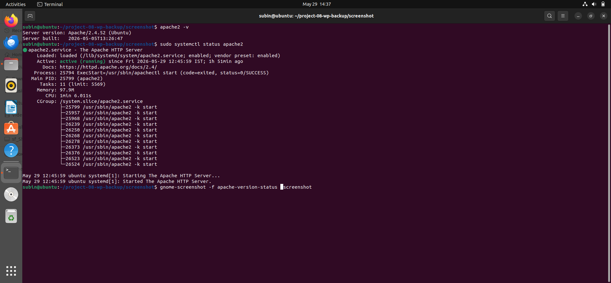

# PHP Module Verification

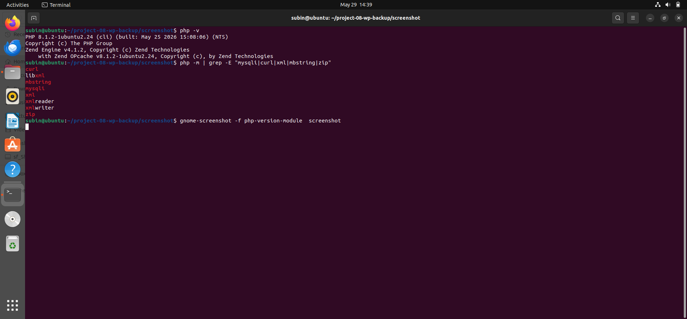

# MariaDB Verification

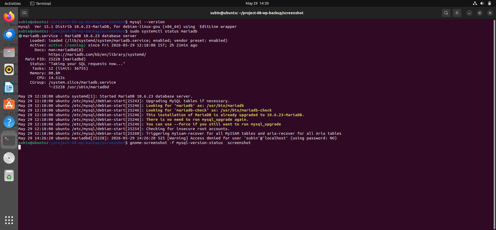

# Database and User Creation

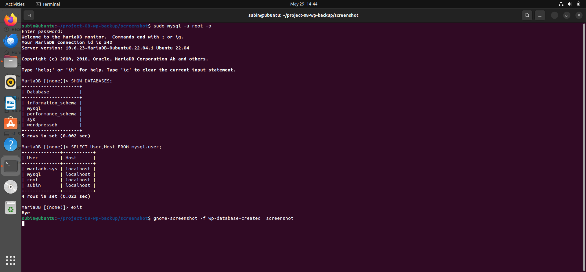

# Backup Creation

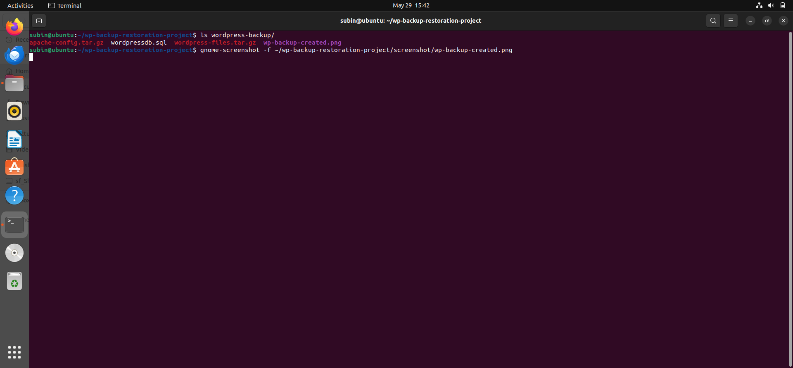

# Apache Backup Content Verification

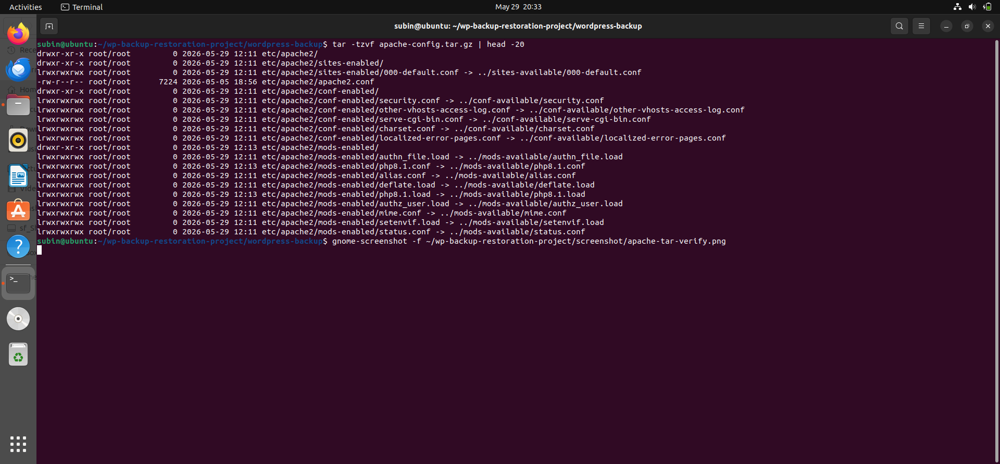

# WordPress Backup Content Verification

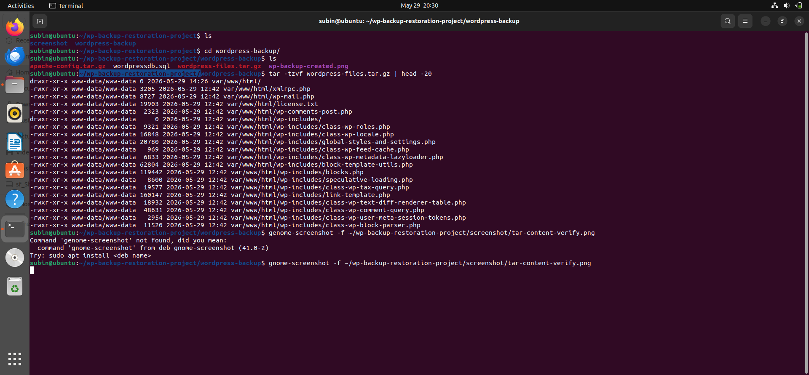

# Disaster Recovery Simulation

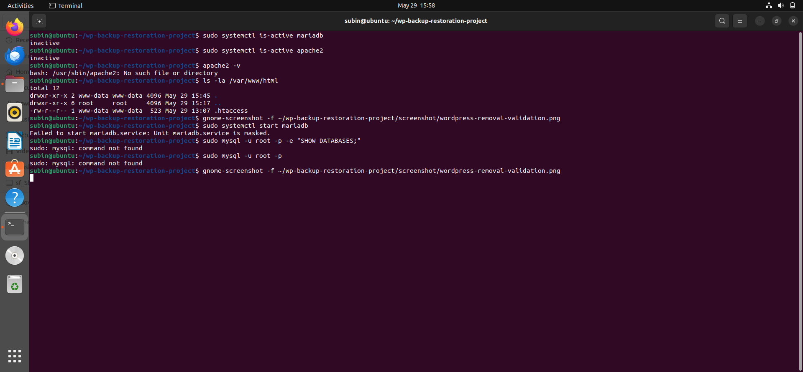

# Apache and Database Removal Verification

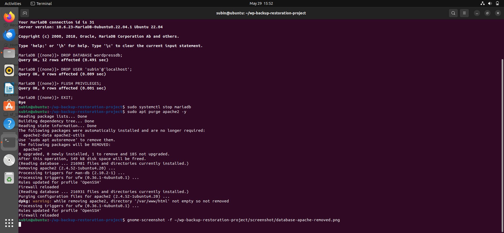

# Database Restoration Verification

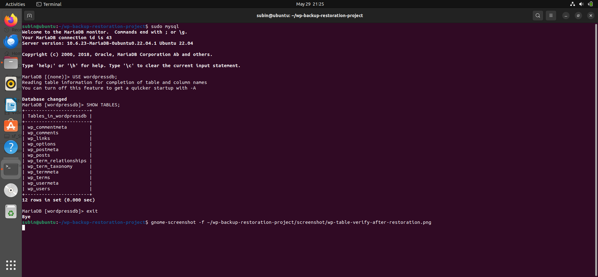

# User Verification After Restoration

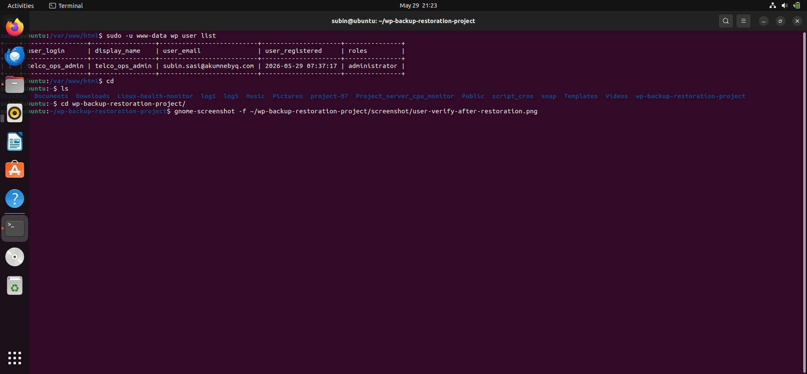

# WordPress Website After Restoration

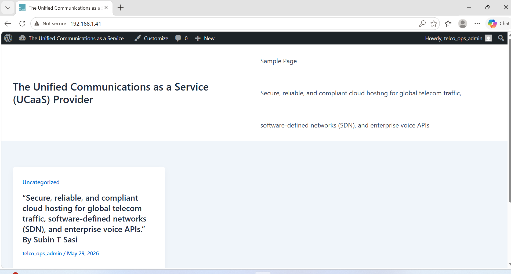

